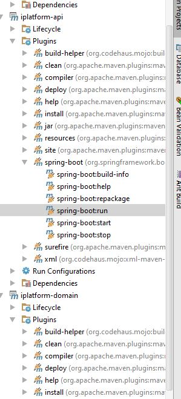

## Author
> Dash Nava

# Solution Overview

The solution is build as a multi module maven spring boot project. 
The project is broken down into sub logical modules.


## Technologies
* Java 8
* Spring Boot
* Swagger

## Build Dependencies

* Apache Maven (Min 3)
* Oracle JDK (Min 1.8)

## Modules

### 1. iplatform-domain
---
This module has the domain and common models, repositories, specifications.
### 2. iplatform-service
---
This module has the domain and business.

### 3. API
---
This module exposes the REST API endpoints. The API contract can be viewed at ```http://localhost:9091/swagger-ui.html```

## How to run the application


### Run from IDE
Double click the ```spring-boot:run``` goal from the editor.



### Run using maven
Run the following command `mvn spring-boot:run` soon after moving to API module from the terminal/command prompt.
<br>```e.g. c:\project\aon-assessment\iplatform-api>mvn spring-boot:run```

#### Test Data for API
```json
{
  "annualTurnover": 600000,
  "occupation": "Plumber",
  "postcode": "2000"
}
```


